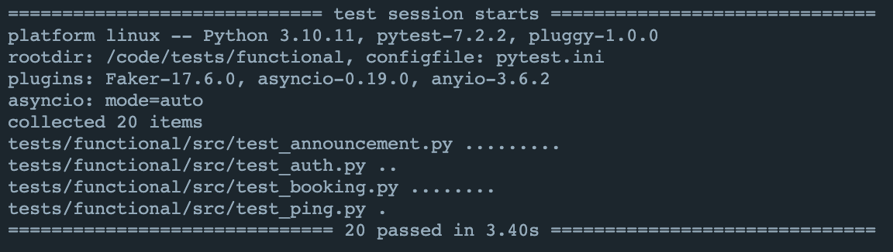

# Проектная работа: диплом

[Проект](https://github.com/GA10v/graduate_work)

## dev

1. Установить зависимости командой
   `$ poetry install`
2. Установить pre-commit командой
   `$ pre-commit install`
3. Создать внешнюю сеть "project-network" командой:
   `$ docker network create 'project-network'`

## Запуск ELK

1. Создать внешнюю сеть "project-network" командой:
   `$ docker network create 'project-network'`
2. Зпустить контейнер командой
   `$ cd ELK && docker-compose up`

## Запуск локально

1. Установить зависимости командой
   `$ poetry install`
2. Создать файл конфигурации `.env` в корне проекта и заполнить его согласно `example.env`
3. Создать файл конфигурации `backend/Notification/.env` и заполнить его согласно `backend/Notification/example.env`
4. Запустить Booking_API командой:
   `$ python3 backend/Booking/booking_api/src/main.py`
5. Запустить Watcher командой:
   `$ python3 backend/Booking/watcher/src/main.py`
6. Запустить Notific_API командой:
   `$ python3 backend/Notification/notific_api/src/main.py`
7. Запустить Enricher командой:
   `$ python3 backend/Notification/enricher/src/main.py`
8. Запустить Sender командой:
   `$ python3 backend/Notification/sender/main.py`
9. Полученить access_jwt_token командой:
   `$ python3 jwt_token.py`
10. Перейти к документации Notific_API по url: `http://localhost:8080/api/openapi`

## Запуск в docker

1. Создать файл конфигурации `.env` в корне проекта и заполнить его согласно `example.env`
2. Создать файл конфигурации `backend/Notification/.env` и заполнить его согласно `backend/Notification/example.env`
3. Создать внешнюю сеть "project-network" командой:
   `$ docker network create 'project-network'`
4. Запустить контейнер сервиса Booking командой
   `$ docker-compose up`
5. Запустить контейнер сервиса Notification командой
   `$ cd backend/Notification && docker-compose up`
6. Полученить access_jwt_token командой:
   `$ python3 jwt_token.py`
7. Перейти к документации Booking API по url: `http://localhost:8080/api/openapi`
8. Перейти к документации Review API по url: `http://localhost:8084/api/openapi`
9. Перейти к документации Notification Admin_panel по url: `http://localhost:80/admin/`(USER='admin', PASSWORD='admin')
10. Перейти к документации Notification API по url: `http://localhost:8070/api/openapi`
11. Перейти к документации Mock_Auth по url: `http://localhost:8081/api/openapi`
12. Перейти к документации Mock_Admin_panel по url: `http://localhost:8082/api/openapi`
13. Перейти к документации Mock_ugc по url: `http://localhost:8083/api/openapi`

### Запуск тестов

1. Создать файл конфигурации `.env` в корне проекта и заполнить его согласно `example.env`
2. Создать файл конфигурации `backend/Notification/.env` и заполнить его согласно `backend/Notification/example.env`
3. Создать внешнюю сеть "project-network" командой:
   `$ docker network create 'project-network'`
4. Запустить контейнер сервиса Booking командой
   `$ docker-compose up`
5. Запустить контейнер сервиса Notification командой
   `$ cd backend/Notification && docker-compose up`
6. Запустить контейнер командой
   `$ docker-compose -f docker-compose.test.yml up`

