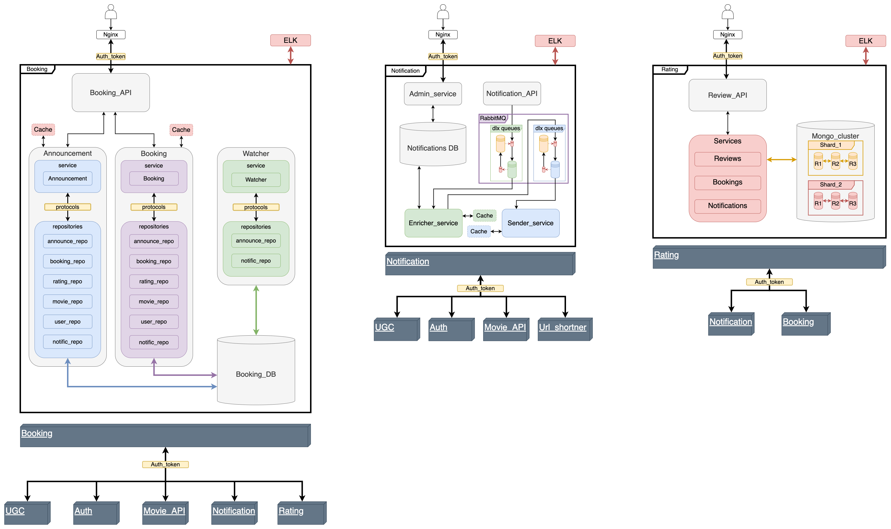
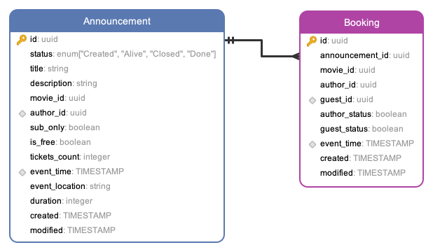
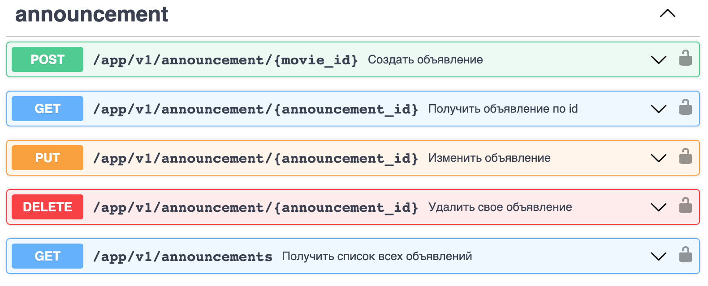
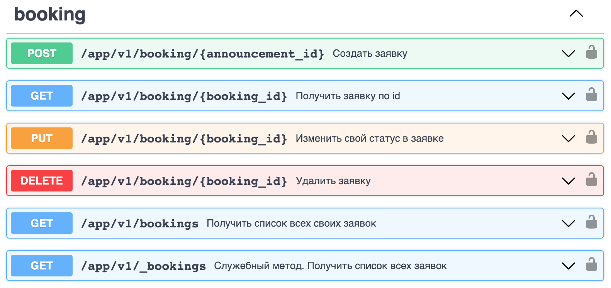
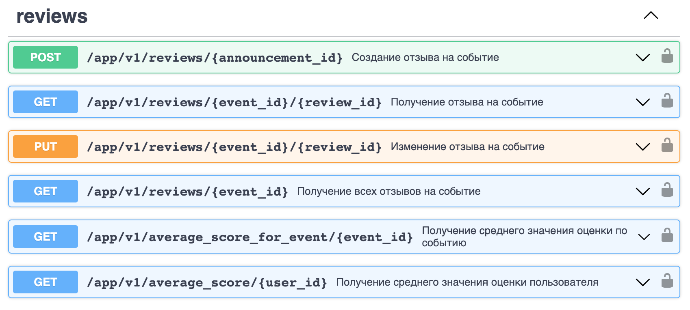
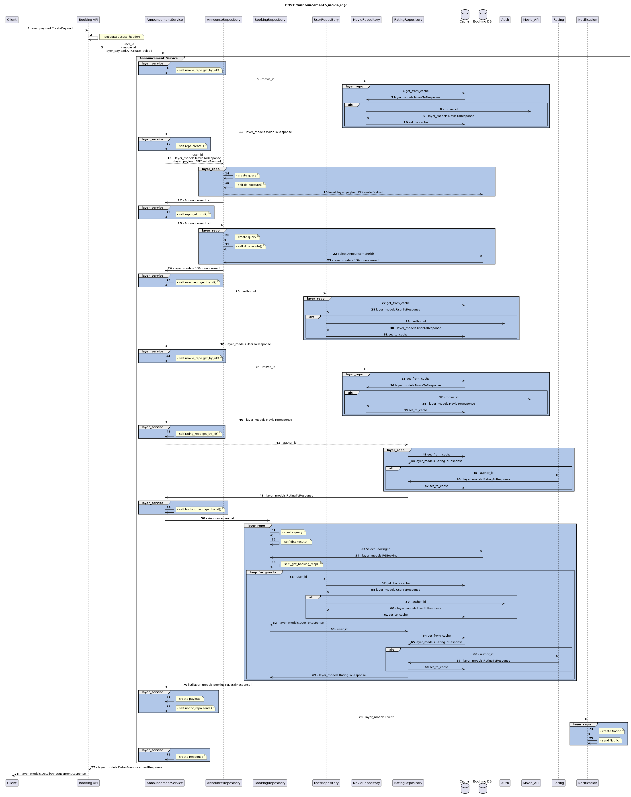
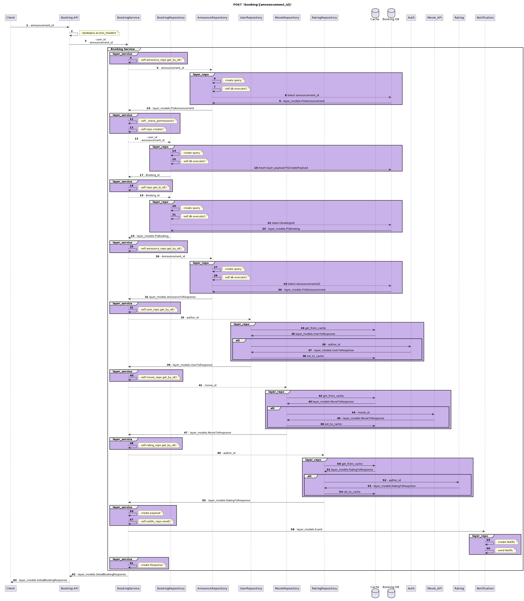

# Дипломный проект "Бронирование билетов"

[Проект](https://github.com/GA10v/graduate_work)

## Проблематика

Сегодня люди все больше и больше устают от монотонной жизни и стремятся проводить время в компании друзей и близких. Однако, организация совместных мероприятий, таких как совместный просмотр фильмов, может быть непростой задачей. Часто возникают проблемы с выбором фильма, датой и временем проведения мероприятия, а также с поиском компании единомышленников. Поэтому, существует потребность в создании сервиса, который позволит быстро и удобно организовывать совместные просмотры фильмов и бронирование билетов. Такой сервис должен быть простым и интуитивно понятным для пользователей. Наша работа направлена на разработку такого сервиса и решение вышеуказанных проблем.

## Цели проекта

- Продемонстрировать приобретенные навыки за время прохождения курса "Python Middle developer" Яндекс практикума
- Разработать сервис, который позволяет пользователям создавать объявления о предстоящих мероприятиях по совместному просмотру фильмов и бронирования билетов на эти мероприятия
- Разработать сервис, который позволяет пользователям оставлять отзывы на посещенные мероприятиях по совместному просмотру фильмов
- Реализовать взаимодействие новых сервисов с уже существующей инфраструктурой микросервисов (Movie service, Auth service, Notification service)

## Требования к проекту

- Реализовать проект на языке Python
- Реализовать CI/CD с проверкой кода на его соответствие стандартам pep8
- Реализовать логирование операций
- Реализовать кэширование запросов к внешним сервисам
- Протестировать функционал
- Реализовать запуск проекта посредством контейнеризации в Docker

## Используемые технологии

Nginx - проксирование внешних запросов
Fastapi - асинхронный фреймворк для создания API
PostgreSQL - база данных для хранения данных о событиях и бронировании
MongoDB - база данных для хранения данных об отзывах на события
Redis - база данных для хранения кэша
ELK - логирование операций
Docker - развертывание проекта

## Внешние сервисы

- Auth - регистрация пользователя, информация о пользователе
- UGC - информация о друзьях пользователя
- Movie_API - информация о контенте
- Url_shortner - генерация коротких ссылок
- Notification - отправка уведомлений

## Схема проекта

## Схема БД

## API

### Announcement

### Booking

### Review

## Announcement POST sequence_diagram

## Booking POST sequence_diagram

## dev

1. Установить зависимости командой
   `$ poetry install`
2. Установить pre-commit командой
   `$ pre-commit install`
3. Создать внешнюю сеть "project-network" командой:
   `$ docker network create 'project-network'`

## Запуск ELK

1. Создать внешнюю сеть "project-network" командой:
   `$ docker network create 'project-network'`
2. Зпустить контейнер командой
   `$ cd ELK && docker-compose up`

## Запуск проекта локально

1. Установить зависимости командой
   `$ poetry install`
2. Создать файл конфигурации `.env` в корне проекта и заполнить его согласно `example.env`
3. Создать файл конфигурации `backend/Notification/.env` и заполнить его согласно `backend/Notification/example.env`
4. Запустить Booking_API командой:
   `$ python3 backend/Booking/booking_api/src/main.py`
5. Запустить Watcher командой:
   `$ python3 backend/Booking/watcher/src/main.py`
6. Запустить Review_API командой:
   `$ python3 backend/Booking/review_api/main.py`
7. Запустить Notific_API командой:
   `$ python3 backend/Notification/notific_api/src/main.py`
8. Запустить Enricher командой:
   `$ python3 backend/Notification/enricher/src/main.py`
9. Запустить Sender командой:
   `$ python3 backend/Notification/sender/main.py`
10. Полученить access_jwt_token командой:
   `$ python3 jwt_token.py`
11. Перейти к документации Notific_API по url: `http://localhost:8080/api/openapi`

## Запуск проекта в docker

1. Создать файл конфигурации `.env` в корне проекта и заполнить его согласно `example.env`
2. Создать файл конфигурации `backend/Notification/.env` и заполнить его согласно `backend/Notification/example.env`
3. Создать внешнюю сеть "project-network" командой:
   `$ docker network create 'project-network'`
4. Запустить контейнер сервиса Booking командой
   `$ docker-compose up`
5. Запустить контейнер сервиса Notification командой
   `$ cd backend/Notification && docker-compose up`
6. Полученить access_jwt_token командой:
   `$ python3 jwt_token.py`
7. Перейти к документации Booking API по url: `http://localhost:8080/api/openapi`
8. Перейти к документации Review API по url: `http://localhost:8084/api/openapi`
9. Перейти к документации Notification Admin_panel по url: `http://localhost:80/admin/`(USER='admin', PASSWORD='admin')
10. Перейти к документации Notification API по url: `http://localhost:8070/api/openapi`
11. Перейти к документации Mock_Auth по url: `http://localhost:8081/api/openapi`
12. Перейти к документации Mock_Admin_panel по url: `http://localhost:8082/api/openapi`
13. Перейти к документации Mock_ugc по url: `http://localhost:8083/api/openapi`

### Запуск тестов

1. Создать файл конфигурации `.env` в корне проекта и заполнить его согласно `example.env`
2. Создать файл конфигурации `backend/Notification/.env` и заполнить его согласно `backend/Notification/example.env`
3. Создать внешнюю сеть "project-network" командой:
   `$ docker network create 'project-network'`
4. Запустить контейнер сервиса Booking командой
   `$ docker-compose up`
5. Запустить контейнер сервиса Notification командой
   `$ cd backend/Notification && docker-compose up`
6. Запустить контейнер командой
   `$ docker-compose -f docker-compose.test.yml up`

