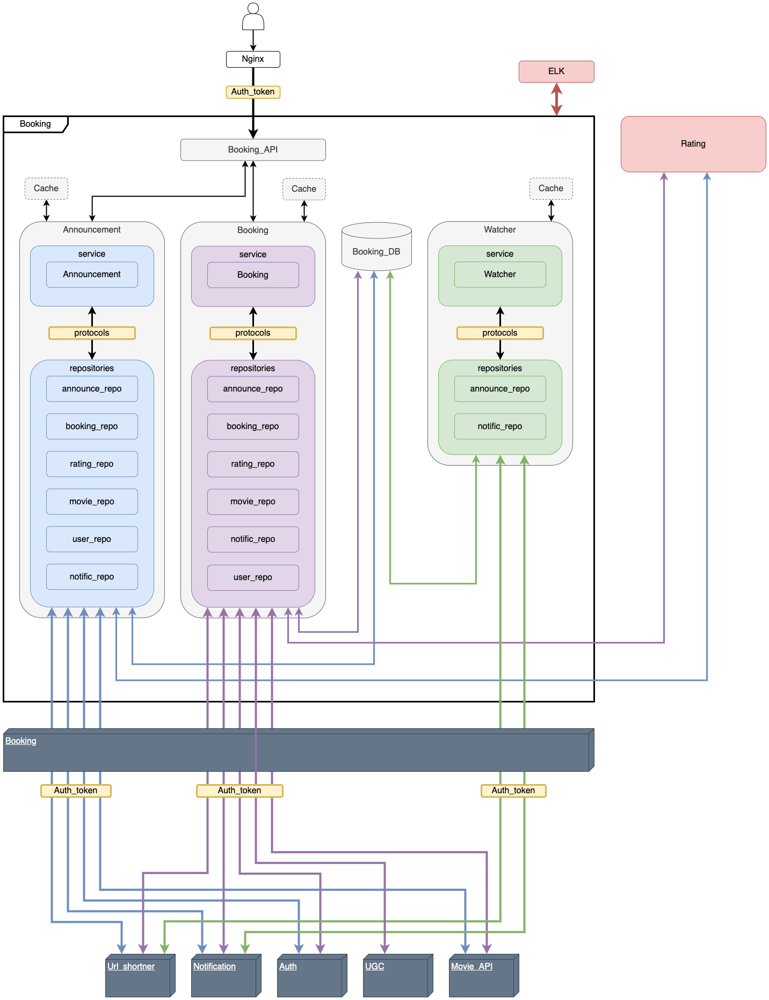
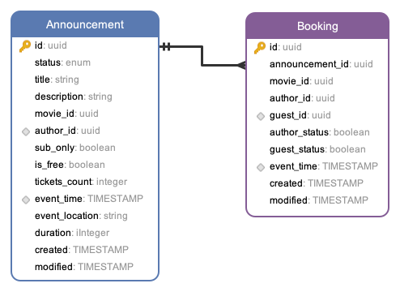
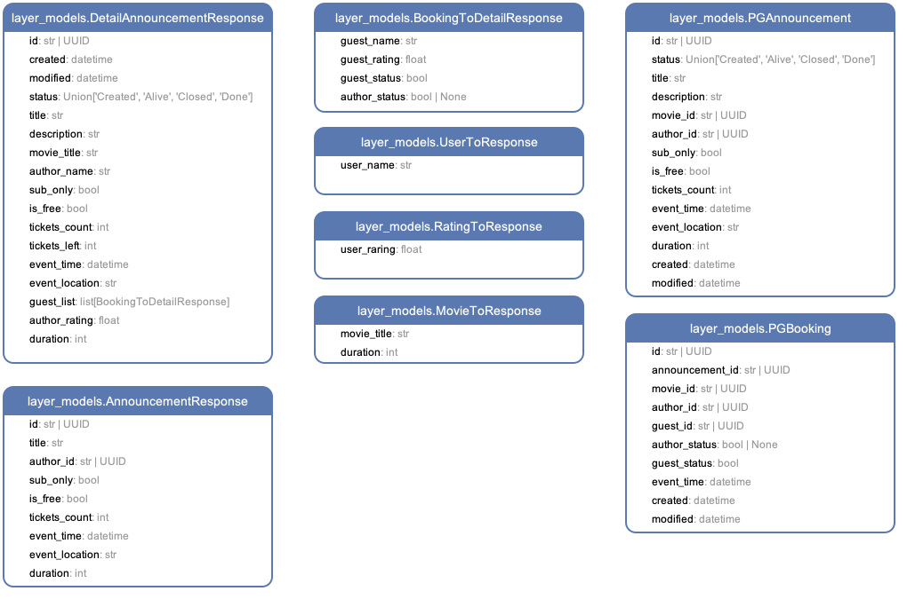
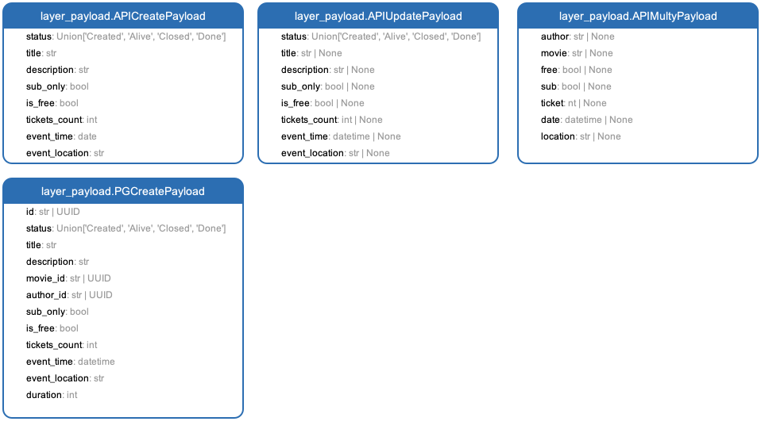
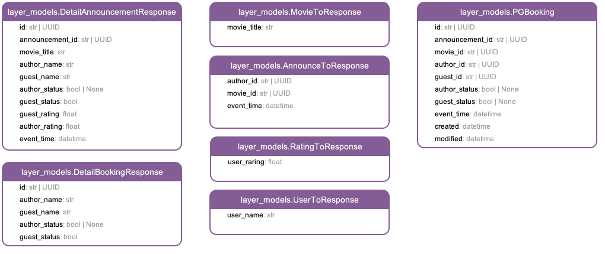
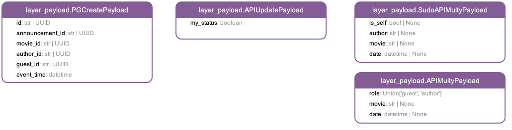

## Сервис бронирования билетов

## Легенда

Хочется посмотреть фильм/сериал, но не хочется тупить в одного или ты в новом городе и здесь нет знакомых...
Заходишь на PRACTIX, выбираешь фильм, жмешь кнопку "Кино в компании".
Есть возможность пойти на просмотр гостем, ищи события с учетом даты, локации, приватности, дополнительным условиям и [*]рейтингу организаторов.
Или создать свой фест с блекджеком и куртизанками! Назначай дату, зови друзей или весь мир, ограничивай число гостей, принимай заявки от гостей и выбирай кто достоин сидеть на твоем диване

### 1. Сценарий организатор

- Автор создает объявление [Announcement], "Собираюсь посмотреть фильм завтра вечером, ищу компанию"
- Другие пользователи могут подать заявку на участие в событии. Создают запись [Booking]
- Автор может вносить изменения в объявление
- При внесении изменений в объявление - всем участникам и потенциальным гостям приходит уведомление и ссылка на [Announcement]
- За 24 часа до события - всем участникам приходит уведомление и ссылка на [Announcement]
- За 1 час до события - всем участникам приходит уведомление и ссылка на [Announcement]

  - автору приходят заявки на участие в событии от гостей
  - автору приходит уведомление и ссылка на подробную информацию о состоянии [Booking]
  - автор может принять или отклонить заявку на участие в событии
  - если состояние [Booking] изменяется - автору и гостю приходит уведомление и ссылка на подробную информацию о состоянии [Booking]
  - когда заявка одобрена - сведения о госте появляются в информации о событии

### 2. Сценарий гость

- Пользователь может посмотреть подробную информацию о событии [Announcement]
- Для поиска подходящего события, пользователь использует фильтры и получает список объявлений
- Пользователь отправляет заявку на участие в событии. Создается запись [Booking]
- Автору приходит уведомление и ссылка на подробную информацию о состоянии [Booking]
- Если информация о событии изменилась - пользователю приходит уведомление и ссылка на [Announcement]
- Когда статус заявки меняется - пользователю приходит уведомление и ссылка на [Booking]

## Требования

### Внешние сервисы

- Auth - регистрация пользователя
- User - информация о пользователе и список его друзей [layer_models.UserToResponse]
- Movie_API - информация о контенте [layer_models.MovieToResponse]
- RatingService - информацию о пользователе [layer_models.RatingToResponse]
- Notification - создание уведомлений [layer_models.EventToNotific]
- Url_shortner - генерация коротких ссылок
- Watcher - воркер для присваивания статуса [Done] записям в [Announcement]

### [Announcement]

- Нельзя создавать дубликаты объявлений от одного пользователя [Index_author_event_time]
- Проверять права пользователя перед изменением записи [HTTPStatus.FORBIDDEN]

### [Booking]

- Нельзя быть гостем на своем событии [HTTPStatus.FORBIDDEN]
- Нельзя регистрироваться на события с одним временем начала [Index_bk_guest_event_time]

### [layer_models.UserToResponse]

- Имя пользователя

### [layer_models.MovieToResponse]

- Название фильма
- Продолжительность фильма

### [layer_models.RatingToResponse]

- Рейтинг пользователя

### [layer_models.EventToNotific]

- ...

## TO_BE

![](http://www.plantuml.com/plantuml/png/tLVDRjD04BxlKopbG3aqWbv0EQ2cAQegKHJrvmGesjhJP5LxrzrTLueG4e-4aBXmW5S8RyJQdhYUnSOohH0Y5zixtynydtS-EzwpJXYNfmbFn0gCPO_u0xU457Wg71WfcCYTLdbw0ORPAwaoOKJABLpde2BWxndtlvcl8IEP2ULc8ewbMl3T9sNa6AmL2vWaSg5u1ChvCXyOSz8bm5zLBLbscywdYGH_41RFI71hN-khelfaThJbCSMH0YPAwTmJIttgAPWR6K49nFDsy0basagdpQh4DfTRsmVunYg5drim0HQN0k2nlf4XYtgDGa-4-vN1xIABXHCNmWBVcefeMOalp-Pu2ne89CuFzWkOFynnXRJiM9xaRaaMNcidBsNagMX50gMIUR1Lo9aidPjaRfVQE0M61WwdZE5axBmeTdrSpUiy4wj4YtWqDI0SpAehvW4R75FQ0JToiNJbGExmzVSV7zVVrf_NN_pnw_eJ5r44riwN8E9Y7475l4Z2AflH6VlKtFgMCdwh_7bQgC8BoiNdKJfiONIUyUPirWDPaghY3_TtfyzUFaTb5W4SVvY0Z4Y8Ign_Ezn2SZaoaEbHL1BQVbm3QfLuKN5WZBJolPfc-FDRG5G-RQWioB4DATAi45fxODpeLiFhC69noWYMG8jeM1Pvf3g6n8xAo9a-0PjfPQ6r4s7PLw5J6xdktybg__Xr3cOLxc5tauPtn_p8qp4kyCtiaEnJspJGciGGPAHnQ_x6D2_0pI-aRtZ7WUwL48xglxERfv10v0ZxRHdNjwE1xHtPsM6pIdVxyjs51KJkbjeq75P7otO-seeg8s4jGgO840FIwaHCV_x0Hyj_yMJ1DsldJc6Sed-736g6lAeGaKRwz6WZDVh5uL1tk9Vu3A4jcGGMkhJVgTIjxIsx38lNnAlKhvHhcrqnIlB9HVNuIhJE-AKsV963THOHNMI99NCBP126cVoEPgVTmjthBzCdbCvoA7MuI-x7BRGAaJsy57q3jjy6QiX4MlU6b4VucJu09sIowVBkNjw1n5r4037NqFyZH435k_c4g1irIc8sVYyCAO8V2FYXEYHpp_VFq-Gd)

## API

### Announcement

### Booking

## Модели

### PG

### Announcement service [layer_models]

### Announcement service [layer_payload]

### Booking service [layer_models]

### Booking service [layer_payload]

## Я.Практика

Не всем нравится сидеть дома и смотреть фильмы в одиночку: иногда хочется их посмотреть с компанией единомышленников.
Для добавления такой возможности реализуйте кнопку покупки билета в кино для определенной группы фильмов. Система должна дать пользователю возможность составлять свои расписания, выбирать фильмы и место сбора. Также она должна показывать возможное количество зрителей и позволять пользователю выбирать дату и время просмотра и хоста — того, кто предлагает фильм и место.
Для данной задачи реализовывать оплату не нужно: достаточно бронировать билеты и не давать забронировать их больше, чем есть мест у конкретного человека.
В качестве задания «со звёздочкой» придумайте систему оценки пользователя-хоста и пользователя-гостя.
