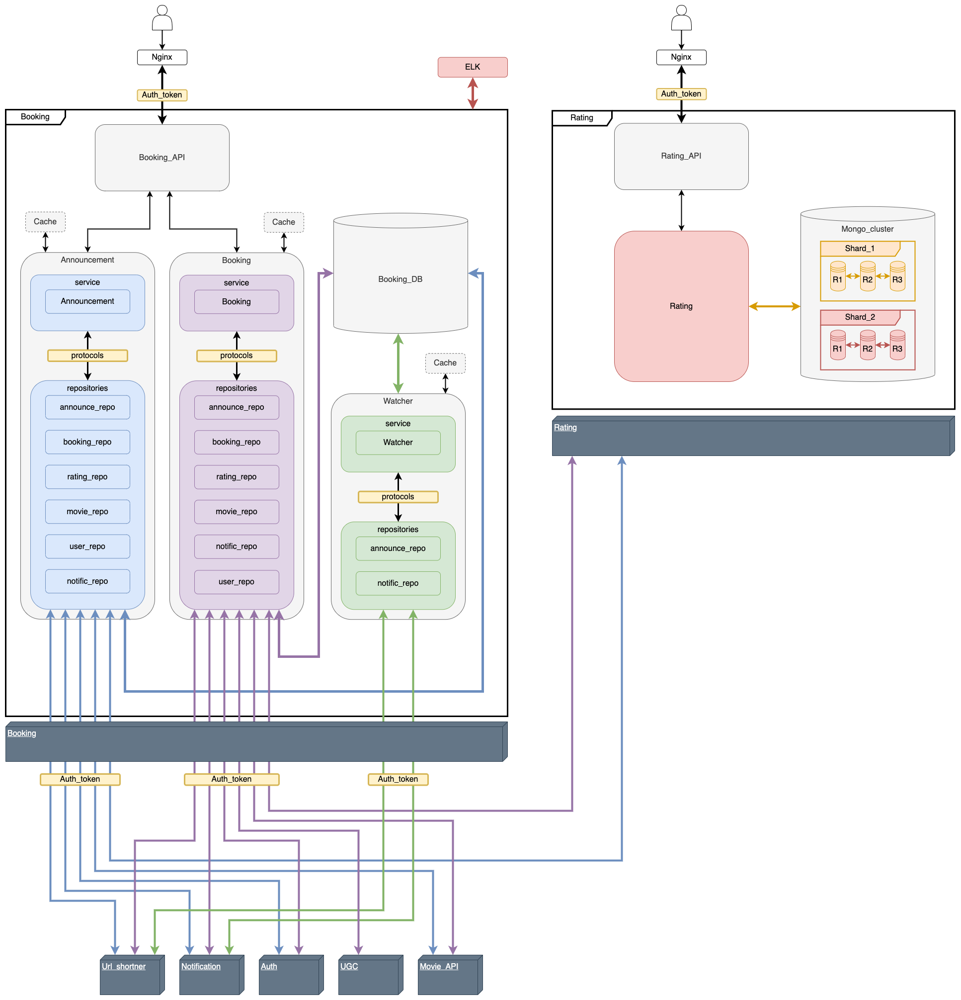

## Сервис бронирования билетов

## Легенда

Хочется посмотреть фильм/сериал, но не хочется тупить в одного или ты в новом городе и здесь нет знакомых...
Заходишь на PRACTIX, выбираешь фильм, жмешь кнопку "Кино в компании".
Есть возможность пойти на просмотр гостем, ищи события с учетом даты, локации, приватности, дополнительным условиям и [*]рейтингу организаторов.
Или создать свой фест с блекджеком и куртизанками! Назначай дату, зови друзей или весь мир, ограничивай число гостей, принимай заявки от гостей и выбирай кто достоин сидеть на твоем диване

### 1. Сценарий организатор

- Автор создает объявление о событии [Announcement], "Собираюсь посмотреть фильм завтра вечером, ищу компанию"
- Другие пользователи могут подать заявку на участие в событии. Создают запись [Booking]
- Автор может вносить изменения в объявление
- При внесении изменений в объявление - всем участникам и потенциальным гостям приходит уведомление и ссылка на [Announcement]
- За 24 часа до события - всем участникам приходит уведомление и ссылка на [Announcement]
- За 1 час до события - всем участникам приходит уведомление и ссылка на [Announcement]

  - автору приходят заявки на участие в событии от гостей [Booking]
  - автору приходит уведомление и ссылка на подробную информацию о состоянии [Booking]
  - автор может принять или отклонить заявку на участие в событии
  - если состояние [Booking] изменяется - автору и гостю приходит уведомление и ссылка на подробную информацию о состоянии [Booking]
  - когда заявка одобрена - сведения о госте появляются в информации о событии

### 2. Сценарий гость

- Пользователь может посмотреть подробную информацию о событии [Announcement]
- Для поиска подходящего события, пользователь использует фильтры и получает список объявлений
- Пользователь отправляет заявку на участие в событии. Создается запись [Booking]
- Автору приходит уведомление и ссылка на подробную информацию о состоянии [Booking]
- Если информация о событии изменилась - пользователю приходит уведомление и ссылка на [Announcement]
- Когда статус заявки меняется - пользователю приходит уведомление и ссылка на [Booking]

## Требования

### Внешние сервисы

- Auth - регистрация пользователя
- User - информация о пользователе и список его друзей [layer_models.UserToResponse]
- Movie_API - информация о контенте [layer_models.MovieToResponse]
- RatingService - информацию о пользователе [layer_models.RatingToResponse]
- Notification - создание уведомлений [layer_models.EventToNotific]
- Url_shortner - генерация коротких ссылок
- Watcher - воркер для присваивания статуса [Done] записям в БД [Announcement]

### [Announcement]

- Нельзя создавать дубликаты объявлений от одного пользователя [Index_author_event_time]
- Проверять права пользователя перед изменением записи [HTTPStatus.FORBIDDEN]

### [Booking]

- Нельзя быть гостем на своем событии [HTTPStatus.FORBIDDEN]
- Нельзя регистрироваться на события с одним временем начала [Index_bk_guest_event_time]
- Проверять права пользователя перед изменением записи [HTTPStatus.FORBIDDEN]
- Показывать пользователю только его записи [user: author | guest] [HTTPStatus.FORBIDDEN]

### [layer_models.UserToResponse]

- Имя пользователя
- Список друзей

### [layer_models.MovieToResponse]

- Название фильма
- Продолжительность фильма

### [layer_models.RatingToResponse]

- Рейтинг пользователя

### [layer_models.EventToNotific]

- ...

## Schemes

### To be

## Announcement sequence_diagram

###  POST

![](http://www.plantuml.com/plantuml/png/lLZDZjis4BxpATZjOTD3d3QN5di8ikiKYnpI6hl9gIq4MfgrYKYaIb91ZI107waeq4iFxIkuRrHA8zeSnwO5GsjT99FV_Cmtmnd9BwqJnZLLoKkn0cFP9V_2BQ42NWa7HWec6gTLKyt1CFjUgbeOKN4BlpQWSk0V6VVNpEkGkQo5SZDH558j-FElkvqtOArOm7Kf5uhde9nNyuan9rq9VFRZ_Lj--KmefHklhFBRppvM-eE4J1QVBXchjthvj9JWRyBsJsJpuaRhzwtPwzdh2uzfxnHm7Hcv1_D1vj01--Vzu3kejPLEcrM7ZPVtcj_1HwiK_iw2sS669GfyqvAnWzoiKUYTS9zxi5raXN1YBYpmYwd8bnXyzvG52W9Yo-QhcnRcRrc_GamUMBvkt98i_A2TV92vTqMhU0CZoNPJXJwJfNUcpEnI6wV0q8tRAMDzPJnzqMRz2WivgyMgrAAOJ0q81pFynJmWu9ZI3hYHYwNhAlKfN__xt-_hVzP_hl_ozx_NVt2Hvs1jjWHHj4S3LC5ReQ2bv-tAYpRMcvJ5pye_Om7Z3-gBbwFki8NHJStZsjmKPESKxdzvytpwxVVVzP7P7i3n2WBe4TqY8UA5eLee7oO6QZt9EuUUVBK1X2ZZ1VI3VMxIsumFnUbKeEeeuc-YY5j76OaWDiftd41WYW720lhOSR40byrNtj-83a99mWVlnEPWNaMXKnc4eDFRyYTu0Wy8lgiUYQbq0QMTT3jlzHtOMYiB1oqIbuzfUGp2iTYudnrcbMPux2mNymdy1ddZuAJSHhtkYhzM5epRwJEpsxtrJ4zGmWZf9wGZq28Qs1IEDeVZv542jmT4qWDoi6-aeq_taJG5wKv1WSDBQJWhwNfELDSPd4hK-ycUqVA_Xn9oH_BpH1PxhKHoHzlFx3RMU7R2sh6Lc0AfGays3dolmtX5uvRQq2Q_kH0P0lF8un8jYbCRbDDsWyo5f5NYV5hNsGiQn_J82KfCxG0_VNYFDiH76ERdJvVfNk8V8r_uUJ3eI4LOlf4SAhMLs4imRgNpHUsJK8xfEt_6vjYdHq_PY_0Pd1xiz8fbg8hpJ-lnNHfnLbE_ze_gW1WsfGFwm93kTyzCKTOMvBP2RNqIK_Z6M6fTymTj-A81won19eB1GKc-SL5qb54-pZYdraaAZgiRHWHjYfIA4Lhm-6sOQAEqdAwIVjWCfevEW59QznCnZN1l-nKu8SlWmI-eVunvCEpOqOP9YKYVkjEfeg7Gps524d8JJv4HCXMiXNy7XnjDH8IlVFZtv1XXlFHnD5NvFm00)

### GET

![](http://www.plantuml.com/plantuml/png/jLVDRjD04BxlKopbq79e2hs0UgYQfbN5eIWgxGaXQsDFurLjhzbTLqHL9Hu98N7X0AyGteYrFKuy-LbAWdsnC_Fvcvalundxn5YXRP4cF14Jq8RjycSsXXHuAYneAPWehCgAT0IQcJkPvKABb1luL40M0dzWt1r3no53cOlC3aKKoMpC3rzMdaimHeoXdyXnnaF8hADvPCnAcm2_EB_ckmSYorJXk5BdFNXe_mfazBZBM3vdvuD4EWSN1g-8S-TKgRioU7_uTiTXoZC5z5lixq7Von0g85wl1bz1heoqIaygRDkyClm2lcMby1i3UW7Rc2ZmKjtBnIncDWgz4dOvWxcHHSAAaJ30TmOYZElYgwi09MWX6ZNFJakOEmLe8I7NcFk5ZOdXdRBoLeOk5PKHHrL9iF1NOSx4TAEJmCHAsmmqTLmC6CFEs3_cZkg8x_C-xIJcp8sNPSe2rt8Ssx9B7NZww_UNwS_fj-btT_un_Sf5688nGGmY0cqOP14lRsfOKArLSTXOgo8dvWREgcYr__dfuU3r-PlwkGiC0ZWUU0E68YwQ--pOvmQIsvw6NFN6O8EHTCdilPXXcWg8eKg5BKTrOTjjlh9CZaTJpgjMEMKM9Bis6oVi2FHNXnM66eHpkzcZ9usR5jT1q4hMQDI3pn0M5b3IVuhSUaYEdCW9X9RekISZmjh2y-M_0ZLELGI9wGqlsaoT2L0O5tBUN1FIN4G9JmOkXMh2OHsYiB7IZedSWeWwOOTOZoozd79IRKh7jRe2awlCmFeeH5y_HrVwfjKKt5vWN0nOISrAPKC4fZoRlXuu8XhuQfqg3nMRKlZLfYoTowshzV8VzCP5vMtf5eRFxlWRUevSALJj8delClW5fppTApwgvjdsaXytBrJ-nOH7WwMtTh9r_26xtpaOoBDoyBT_spIeDSi6lHsL79IDCUyKa_ih9syWYL8vlrMQZmimrX34Kf9qQHG6w5Fuz5Mq_JgYqQY4Jw7n5qg722rryn6r_PYYBAJiJQde2wrF4ZeH4sdi1n8AuTVg3AoGIHFn8_9kC1_zxKy7ZQz0x7vFwVuKwQSBARgkjJrDDr4QsPilhQS7MQQgNpdmGt-RT4zSlaMQ_040)

### PUT

![](http://www.plantuml.com/plantuml/png/lLZDZjis4BxpATZjOTD3d3QN5di8ujqKGGyfZ4ryQWk1bcPjOYLHuKzG8mZGHoeAzD93-mhk6vMcFBR6bJ66eKWNoPnlVkQR4OVMI-ULzQ4gPQdMO9subb_u5LGWA-N1QYLKyAOErGAiS8-wRfHLbNJmFa2TW_mePBncqORETQDgFrD5eUkbVFvrahm1vzGIfgLUrZA7saSpduJmsfSWP_DtylgPgciJegqgIfzzxFxATF7fMeZcO5tUbHhYJRdT4n5UtHhpk7K-dVrmjSN4EmLCEzRVWlsWSqZ0tNC_-1uQuxGtTfsmtULUzqVupYg5pntO8omkKU0Ryq4VHx5Vez1xvVyVmM5H5CghXN8Wh-vKlcgJJqyPKe280vklRhUmUCjsAyJbYULfy2koyAFn-a7dCHHJ4q7A93ikLHipMPhRCdChOtqDbWfUtmcnwuodBxPLlsdREMlKkZIgcCoRc1RCsbyY0X0dQkD1MhrS-TIlJ-Ncdtz_s_oz-MFpPxp_jVbTgZm7vx8Lg0Ai4r0NSgk4LdQytKJLuC3-NCS7REBOmDlVD9QebyAn68vOMXCQsUtDVKEce5hvbxVFxxxz_hjTPguBY1TgT4BQYsYEUCKu7PGFaonMFt_C6h2LTYvMnptvQe_3R0VmOw4nav0AqUE0BAI4Urn6dzstx-OCgcdbqI8o-as7qMryWWJUzIMFV2SWatYRV6v1HV7x07QDOfBwu4wHyM8nWLyX3uJmSpr7ruTN-qQsFCep-JrHIAwP4SFq6ij2V-yjmMSB7Hk5iD7NXdmMN5jEwHZhAZCTY82BUe9dXM_C7bB628fftCiZetty5ah8FQdF4rtqUkdeoPuIjpMhJ06bcynUTosEJbXmgNsmoTUqoRb6Fxq3fFC8xhJ1huoDbdjL4PaIYqXM8w4azK4vtGhUcNjmZQaTy5unUDxMwFMfqXbd-0BXCR3DE7avHJSYKshxCnUlXaXKw-StIPXYeJObbxSsVhbiEdn-ZdhjZ-ByAzN1ohtckLe7ZLw2Mn6f5-EVfCBP6xzYYxHF3r-o5_ZtZHdiz48TQcByQSs6DFgiPkBg6TM8E6zA8_h4aDv9HwOeImsvxr3NNC0KdXXBOnhvOAnS1d3U8P99XWpPu83k7XUEyk77EVLEYycOuuYWsoXFnULRy93RCBN6qyAOPFxOCDJH2L1gvtyYhbjuzFqAlD8bHl0Bshzq7Z2l7RDXKYBujuwdYa-5VXOY9BNSTAV809L2R_XLYtVAlpUx8r_xMMs8D5x6F49L_WS0)

### DELETE

## Booking sequence_diagram

###  POST

![](http://www.plantuml.com/plantuml/png/lLXDhjis4Dxp5CphugKBEqLs2T0YVavXP95MU4bs1GHQcaX4958bgQ164A17AWfqqqLx1VT6fIJAyYXCncWDQIDvvfkV6NuSIdvcdJ2khIjUYGCOosxv0rT23RmM3emKJBHEgxRUWs7sdLIDCABc5dvkGMN0Fp3khyJxa9biX7A9o7Ef2lxucrxp4gmL1MmgMIYUWNBUpKV6d7GLyEJ7Lw_vxQEzrjvnyUY3K4gttcljSQdCFzuoraoU-RQIu6_2XYUalBaRlF1DykAcm_Xx5F0Ap7kPGOy9pr7SFJJQIgVDeOUUIJ5y4vAUuS_5sE2D1JC3Zo8CVAdVoxdR89j3xuNxDEL9o7BXn5vOu3TRaPL3yVrJ6bfmGaoDV7xNmVmj3H8KyZFYJUjA9FX1E_bMPZuLhP2YhoIThLB86OdUc2grfJPEWS6AtPQnG8hLTzs2F-KhFYCHy-9HovHsm8qiIjUJSyMFV__pw_6lu-_7F_pzp-DlN6GPM9kM8F9kDu3AUMSqUWdTwkAq5ept_vEAn6I5qMqpSkP4ipxeeFfg--JkyVTFXbsNsW3WuGe68I9IeHAcQyKjL6_N1XgzpWm81m-_FW76Af2WpuDz6jB7FECwMMamZvRLPSDGccUUEGw4OB4YSQ5Z7dsCTG4ktHzyFg7eUU6VJyANYxPgX478687vpFZo6eObudw8cWEHyRM2XiRb-pNy0bcB279fP1zwslTFFMSgoDoyNyX-WlD8fmUQr3g7ogv7vMjz3xRHoi8NCi4afLrTduPP2TaxBbfNwcvty0VVyg85spqJVRrQ1fX42uIaAKJ4dJFeXR9WN5YyHXmgBV9rijlsbIN3Rnm2JQve33ocWmRluml7C3sEwQwXpat3Ik9X5PtKHDtav8uNJmvi3BkSEtGtQFh6cx58IZIz_qDUqO4vGXxAF1vWCg46NR8BseLxH1-_DAilF8qtNpgDwGDoUORIIItEKIAp24THsscYqgTxiZltIASrPpvzm2-w0LeBvlha3n-2wBKxPXTmWLQjAmbyZ-7OFsvefvYQISOCUTEkbbwNkl-glFh2XE_kKEuG9DxgW0o5dJvoQRCHUJABDhVN40iLh75hQMTBBvNfF_MllrRJ_nxaDfgG_6HtcSq97-_ie2BMoOFYZQNTBVsIXkkWpnhwpPL-SqSTU0vEo6e4nxEXu-5t-R0jwJXnJs6l3dz0_O-4d_cCsxhw5m00)

### GET

![](http://www.plantuml.com/plantuml/png/jLR1Jjj04BtlLspf0NeWLDpWK944X7gWYYZSAbcRzH2li7VDxXerGaZzfAfIBpsqlv3-KJSRJvm9ZeKAySNEpDltTbvcxJbnNbXV5JdFnHIiOxlyZS-W05u83rO99YflT5MCmJ9tgtGfh2YuWxiAj0J-m7YuHe53ILKAxKSYJPMUyCFtCNC1pea9z7CrqLo2ze7caJ6lV0xy_EoAxnwCZGcyauE7-Y5HwUCkOsN3oOUvWd0JhduYoPt1OXtlZpxkp37XtWhu3FPUIOYO-haLTmcbSSeREutGbIY5zxKsbPQmXbyDqmNN3kmQ64CKU67krJhjCaQXby8_tN8JPAdmOYmSy9sXa1d4T7nAq886WKQU3kQmS4lg297S4EvNFYE1JyQh6oM5LqQJHAmaMVkNwZsJqBND4vSPwpLOcZWVCbOtnVu77gYE-JuVBFk7XGWcc3OUk5MJpCyxCk1cV_v-c_sU_PZz3FTVi-zSI0dE9Hc85AnZe5C-NuGijL5pYSg1_QAf5fjOKvKOGJIBOelKs-7HuF3iQ7744jS0ueKhLgIMARftl8A-W_ocbyWCv6rIWYsKSy5cj_TkYSCgNYvZeJIz2VXah4AzRH8a4cjkgIxehXmb-eSXlDqn6_1aOoiydD0YhACiB4rQ425zLu6TOffMzRgIw6Owxi5Na9K7TFBvka6uENt7mTeSf4V8daefOGFbJxoldIrC2hdhZSxhx9Pg5lKhCMbQQKfQYHZGMJ--NR4E_5s0zjX8U14m9uktqYdTejll5QBSsYl4hkw68Mmj7RFArBaDqdcK1P5NvX9SQRJRrg6h7DXNQ3xyMkEd8D0GFEQZVPNFDk1YZbC-QimyqPZIha4DwQRObgz5_9I_tDWu4c0P2r9g6IBYXfi9OZCS4GXlR-EOeKPJYcwdASbshRPnFdgvrpWSThHnW-1BV3SMSHiSMgIepvI16FHiccqD1IZG_Swb4q_7PiW8IIew1IzKZc2YsicFX3ZaFekNCjHdOp55_yV6Ja2dLP7_0m00)

### PUT

![](http://www.plantuml.com/plantuml/png/xLYzRkis5Dxv56mwv7QmRt6tP2XYEqNG8OMHnbi1WPPER28IgP1KK2C8q4Sg2dJfqBw2-qQbAD77T5ZGW0rDrIA5vpi_v-Dt5CetsZ1bcgga9Tk0qkIIVcNMK06jc0756M6DaQAfbg28VkQYPefLLCDB0o87-aQelUOs1izvpOIPiwBWOaM_VEiizw0rMy6av2j1Sn36Xdadn71J0fql7kdbvwMKDkxgyrl_aF7Y_PAG6cFIMSd1tfZkdmBZnRJpevFv3nSMqzwZW9z0lV8S7AP_Zk8Ue9QQ6was3hgt6i8dGiZ6ad20n-L3XuK6TG3sIo7mNhxomx2xjH3wmCp7ad6H5Com9TD0BsOiNtVDkwVCK-0HIEJjj8NPMzQl12d_OtdIc7MmyACq_8ddjXGf0eFh93lOfRxcO6cXoaolfJ82L6Yucn7IYsBqNRlXrtH4KJy_2phg19tLR5DALemNjUqJvjrVn7fuHoAa0QhuQcsSOaTq-_S_lsx_slw-_SFU_zp-HbcUWzRP6bZHZWY8WhPEFafFP5j2eq6v_Aboh6jO4LafsTHUR3jzkf8wqzUpg-cNxw_wGBe7qExo3bWFce86yHfH3UNJEBDQo9-p6bJ5jUPIw4_Vx72-rTFJAAZbk74jn-FZWckNV4nfS-xDuabqO_GOjssj96XYBoyDoq1Od0Aa8LV0hFcb0RNnve24iwP4velb67w1l47YZyzh4-EuNzkjA24t7lA95s50XDB3lV8RKia2IZsUt_NMIEx_QUwa6ahOKXOg64D5f-ROzqPoiDCSH0Pz1IPRyemN8HUHcKzqaNu7J7TpZsx9uGvXnoiXpKPQZ74o1YafBTP4NQU_8qv_Lmp54UlFSHagUXCgEgtgE5zuHEpxzNzN84mePBm29ne66LwXwQA6rcYYieX60zgF52f6ZIfrFsAwh4FbXz4yyb4-WAwbq4E_9DpfwlpYTvyyuG4kwkTnZlR6h1DuXw5X_93Gre1afd9YtUbGm-vBvRwVphynxhlCjzibYLEDIDiOViwbt12vSukIwop8Rge2f3OTREYjKkwZzlnxXL_uoJ529Dtv7UU3-2YpdGcfJMOFY4s76_gGXdqa_zSaJgw9el7tWf21Mp2CbnuSLfFE5p_BzsEPpXEFrCzgzrFB2GNVs8gRglmN)

### DELETE

## API

### Announcement

### Booking

## Модели

### PG

### Announcement service [layer_models]

### Announcement service [layer_payload]

### Booking service [layer_models]

### Booking service [layer_payload]

## Я.Практика

Не всем нравится сидеть дома и смотреть фильмы в одиночку: иногда хочется их посмотреть с компанией единомышленников.
Для добавления такой возможности реализуйте кнопку покупки билета в кино для определенной группы фильмов. Система должна дать пользователю возможность составлять свои расписания, выбирать фильмы и место сбора. Также она должна показывать возможное количество зрителей и позволять пользователю выбирать дату и время просмотра и хоста — того, кто предлагает фильм и место.
Для данной задачи реализовывать оплату не нужно: достаточно бронировать билеты и не давать забронировать их больше, чем есть мест у конкретного человека.
В качестве задания «со звёздочкой» придумайте систему оценки пользователя-хоста и пользователя-гостя.
