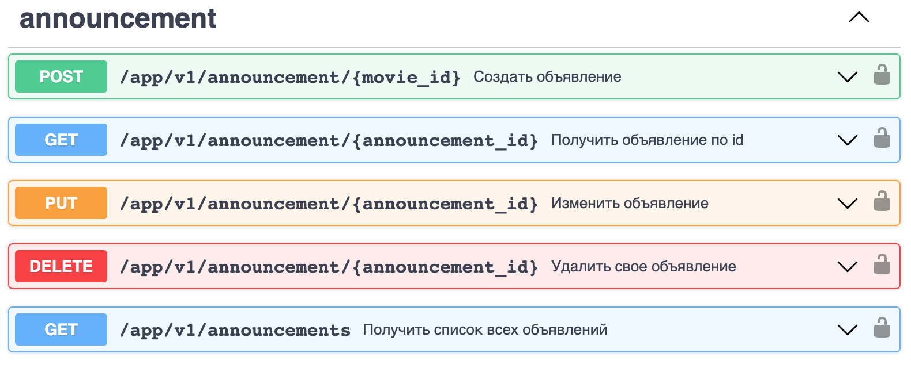

## Сервис бронирования билетов

## Легенда

Хочется посмотреть фильм/сериал, но не хочется тупить в одного или ты в новом городе и здесь нет знакомых...
Заходишь на PRACTIX, выбираешь фильм, жмешь кнопку "Кино в компании".
Есть возможность пойти на просмотр гостем, ищи события с учетом даты, локации, приватности, дополнительным условиям и [*]рейтингу организаторов.
Или создать свой фест с блекджеком и куртизанками! Назначай дату, зови друзей или весь мир, ограничивай число гостей, принимай заявки от гостей и выбирай кто достоин сидеть на твоем диване

### 1. Сценарий организатор

- Автор создает объявление [Announcement], "Собираюсь посмотреть фильм завтра вечером, ищу компанию"
- Другие пользователи могут подать заявку на участие в событии. Создают запись [Booking]
- Автор может вносить изменения в объявление
- При внесении изменений в объявление - всем участникам и потенциальным гостям приходит уведомление и ссылка на [Announcement]
- За 24 часа до события - всем участникам приходит уведомление и ссылка на [Announcement]
- За 1 час до события - всем участникам приходит уведомление и ссылка на [Announcement]

  - автору приходят заявки на участие в событии от гостей
  - автору приходит уведомление и ссылка на подробную информацию о состоянии [Booking]
  - автор может принять или отклонить заявку на участие в событии
  - если состояние [Booking] изменяется - автору и гостю приходит уведомление и ссылка на подробную информацию о состоянии [Booking]
  - когда заявка одобрена - сведения о госте появляются в информации о событии

### 2. Сценарий гость

- Пользователь может посмотреть подробную информацию о событии [Announcement]
- Для поиска подходящего события, пользователь использует фильтры и получает список объявлений
- Пользователь отправляет заявку на участие в событии. Создается запись [Booking]
- Автору приходит уведомление и ссылка на подробную информацию о состоянии [Booking]
- Если информация о событии изменилась - пользователю приходит уведомление и ссылка на [Announcement]
- Когда статус заявки меняется - пользователю приходит уведомление и ссылка на [Booking]

## Требования

### Внешние сервисы

- Auth - регистрация пользователя
- User - информация о пользователе и список его друзей [layer_models.UserToResponse]
- Movie_API - информация о контенте [layer_models.MovieToResponse]
- RatingService - информацию о пользователе [layer_models.RatingToResponse]
- Notification - создание уведомлений [layer_models.EventToNotific]
- Url_shortner - генерация коротких ссылок
- Watcher - воркер для присваивания статуса [Done] записям в [Announcement]

### [Announcement]

- Нельзя создавать дубликаты объявлений от одного пользователя [Index_author_event_time]
- Проверять права пользователя перед изменением записи [HTTPStatus.FORBIDDEN]

### [Booking]

- Нельзя быть гостем на своем событии [HTTPStatus.FORBIDDEN]
- Нельзя регистрироваться на события с одним временем начала [Index_bk_guest_event_time]

### [layer_models.UserToResponse]

- Имя пользователя

### [layer_models.MovieToResponse]

- Название фильма
- Продолжительность фильма

### [layer_models.RatingToResponse]

- Рейтинг пользователя

### [layer_models.EventToNotific]

- ...

## Schemes

### To be

### Announcement POST sequence_diagram

![](http://www.plantuml.com/plantuml/png/vLZFRjG-4BxxAVphxz1ow1Pw0Uq1TRj5LG-5LV-S04NUPBfhDOc3xLIigaey4aBYmW5UONaZd3XnCy5TiZGLX-QInFDvPhx9-BELFQMPr7aIqvWjG2goIV_JSqY09ao3v8omN8iqJwOWYRhaQSOaIwY23pca8T1hGiqrCJvuo3EMwWcB8fxEwExJqd8CIh4PZ68-Isa8gJPkRWZHNCT09szEp-Zc3ajJaHjdYJ7lN2VYYaF0evjDGh9RltGSSsEdJ5LFoBYnByHb4NOqETemcEAE0QD6a5EGLpo44bWz-y4da0d5jP0BwxGnx0tVmZT6CVnSWMnXwo4CF2wAqKAwCGmzOVht36u7ISGqcp85T6FCmhabNpu5TGaSmbNpOB-0cLjGZQ2GTmoFSZr70w-5vXSyDAc851bA9a7xKzcSqT2vZ0Cr5rAd8B7XS4n8rHdRBwbnDRID76Hi4GiM3SOIc8Q9VIC6KED8AZHGoMTpNNRgDbt--Fbf-NtvPVdLtByjFrCMXg1KC0SM5Ki3qeWMaselLTs6PcgkJ4WUlKlDisrW-u9pCVDmEcGcHPxHPc-wXYoJilR_ztV7pr-zg9Yf2a3jLK-m6M4JfkYkRQeWlXX8oCGWB1FQUk80ZcNrOdCW18KoiPgBuUzBW5W-Qx0iaYDrKYWORGNloDRcL7AUWGwc2vEVZxO_Pi7OBRnXWwB3MtETe6jjX4NGmahRRYtvH4GGgq5fEHCde3AHAl16ScbsyT1NGMtJKBC7o8MdWZr-jMWwW8yGvXhM-bODRHhI8yDSwfOkJ0vH7tgw7Jd5wnsjMDi43xvONUDo4x27zRgIGdibFew-mMrp2Z646jLfYqVEMmFxnsKuEMnwwPLe8RiTLEtEXMBF7JPdbkkva4sXijOgEMFremeBnRum_yA0T0nvHzGxpFyNsyAQkyAZsXIGJ9M7j_lKqnrP_ItPi5E7NeMyHNcBOKsedYXEbu9Y7prNT6eqPjsIug2LIgqIVdSvB9gAqlMdl5hbSQRzX_HhVkUuVkcl4KZriVAZXBt2NraVY79GDeJh49LrOcvt-LY8Z5u8IMSvAArm29oa4tTyraTJkcyNzzqsS3HSmWvkLXD5Oh62QdSPwaUEi1T4UtrN-A3eBmDMl9Wh_HQvjt3Z_m0qut4TvNqlseU411DeT_NgKpi-jYC2Dk-c6hf03PVLRFTteRkJ-ZU1_Jsnpimz4pzFuby0)

### Announcement GET sequence_diagram

![](http://www.plantuml.com/plantuml/png/jLT1RzDC4BtlhzYltw7bq1Hw0VM0cgPLnQ4eAkq98MjZJvDLxLspkww8gahy98J4XGFyXV2FM3jZnnCRKwl6bxWxRz-RUTqynyVM2UEo9EQnM8AnR9V_vnQG04-40oC54vdJAajcO9YzbIeLHYJSmiSCL0Zydd5_JJs736Kgb9kAA99gpW-V5vKBi5RCOHpBkU8XAETf7XXpqiN0py-k-Ew1K4fddYlnrOFx-b-1Z1vs6Kitx7mIIr_Wmk8TAUwSQ7sRYu-dRtPoZF-aW76D_HsOEnb20SJxTl0bfDfAfysomDQNM-MtyBZQX5zRC5lOSea2B_ITtEwYMgFGI-6Q7MmMMIISc0aBV6SYmiLw-E8kG0jgYDBDqvCSvZy2N26IVrWUPsv15jvg9szaw5lHYXIAIOAjVnNsJ9QkJHpOXJPEWQ65ymbZU3BsNtDFTSJt-PYU9EQNoofJsW4tShvm-IdruDNFNvzNFrPVLz_yv_VL5ox24AmD5Y0YC9Q1YdY-gMH1jzfqsDpeB2NB9PmLQklw_oU7avTdhzRVky0YWEE56r2Ab6ZlrRNFBSGt8mEf7it11JFfczbxLc6g2V2FTHkC4JKlLp_URUEH4LxKHiYLIpN2mhTO_pv9Q43uaiyOismEC8W8sXNDHl09mim1jQfRgNReZxnvCOIE-BGdeugjXkLDUz6xH4SGsz7qlCuowA2PzJARmx7iE1nDHI-9oLJqB3AtqCOpb72iOdE-seegAfnoqVdpmfM-19jgPQ6LdVhNlNz8_v8yfPvW80OsTbsmrQp1AhPN9M8xjAoMq7OlYWeraofrkqaP1hVJ5F7-53-hXrhxaQpLUONkGcvGhMQiIzJFfWvfivjZQ4TdFcFwMaf5CQKwWn-l2jlSIc3DbhjJddOwl6GpytlhDgE_H93KfybF6suBVgp-ev63ua1K9yIcZvaSd_AnrYc_qORFCx3E4aIZIHhkcGNoJUltk7ZYOuEgKGiVGzCzA0sBvgZzOsYOEA8iTEpULFI7OhiDDF5YQTrxGe_mAtqAJiYuLFamHFRH8A43q5DDHsdAqf_qP81rt_Kqh8HgbBWRtp3waE0h1RxGzjbvxFMp9FuD)

## API

### Announcement

### Booking

## Модели

### PG

### Announcement service [layer_models]

### Announcement service [layer_payload]

### Booking service [layer_models]

### Booking service [layer_payload]

## Я.Практика

Не всем нравится сидеть дома и смотреть фильмы в одиночку: иногда хочется их посмотреть с компанией единомышленников.
Для добавления такой возможности реализуйте кнопку покупки билета в кино для определенной группы фильмов. Система должна дать пользователю возможность составлять свои расписания, выбирать фильмы и место сбора. Также она должна показывать возможное количество зрителей и позволять пользователю выбирать дату и время просмотра и хоста — того, кто предлагает фильм и место.
Для данной задачи реализовывать оплату не нужно: достаточно бронировать билеты и не давать забронировать их больше, чем есть мест у конкретного человека.
В качестве задания «со звёздочкой» придумайте систему оценки пользователя-хоста и пользователя-гостя.
